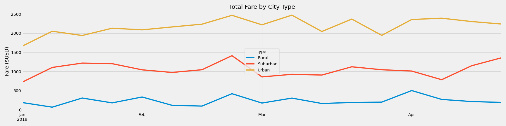

# PyBer_Analysis

## Overview:  The purpose of this analysis is to create a DataFrame of ride sharing data by city type to look for trends that might assist PyBer to discover general trends and sources for expansion.

## Results:   The primary areas we analyzed, compared and contrasted are city type difined as rural, surburban or urban.  One view of your Pyber DataFrame shown below give you some of the data points that we have been focusing on such as; total rides, total drivers, total fares, average fare per ride and average fare per driver.

As we would expect, denser populations will yield greater total revenues; however, additional research of our data frame should reveal answers to other questions.  For example, are the number of drivers in rural areas sufficient to the demand.  Are the higher fares for rural cities simply a matter of longer drives or are there other contributing variables.  We will continue to develop this data to also answer questions regarding saturated areas as compared to under-served areas.
In the chart below we can see the magnitude of difference in total fares by city type over time.   

## Summary:   Reviewing this data brings us to a few recomendations:
              1) Utilizing the data which shows higher fares availble to drivers in rural areas should give PyBer an easy path to additional recruitment of drivers in these areas                  by promoting these higher fares to prospective candidates.  This will increase service, customer satisfaction and revenue.
              2)`With the volume of total fares in urban areas, the number of drivers compared to total rides should be further analyzed on a city by city basis to ensure
                 sufficient staff and service.
              3) Suburban areas are rapidly growing in size at this time.  Some of the revenue generated in urban areas might wisely be channeled to marketing campaigns in 
                 suburban areas.
